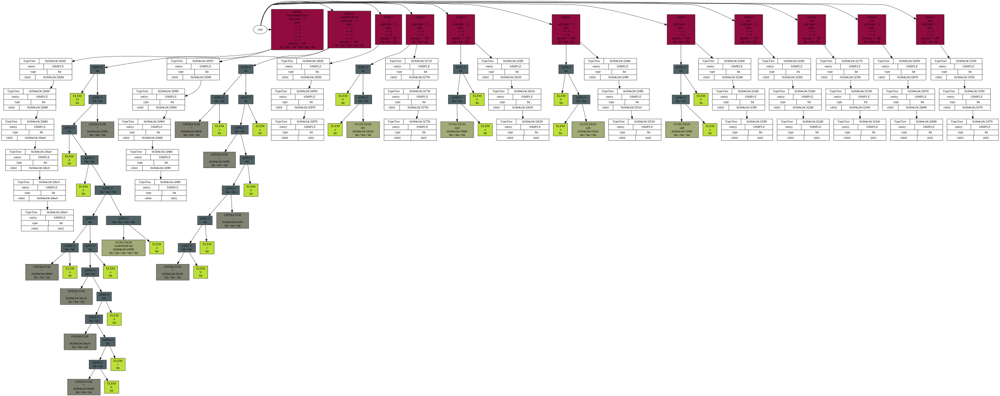

# Untiled project

### Предупреждение

Добро пожаловать. Прошу прощеня за беспорядок.

В коде очень много грязи, уродливых решений и почти полностью отсутствует контроль за ошибками.

### Состав команды

Если честно, почти всё сделал червяк Николай.

### Описане

Здесь есть разбиение на токены и построение структурных деревьев программы.

Пока есть возможность только обрабатывать функции и операторы.

Функция — то, что из букв (medvedy, khrolic888, barsuk) (Название со строчной буквы).

Оператор — то, что из "операторных символов" (?#*, *, =, ...).

Тип — функция с большой буквы.

Для этого используется контрукция:
```haskell
def <FUNC_OR_OPER_NAME> <ARGS>... : <PRIORITY> : <TYPE> = <EXPRESSION>
```

### Статус

Не готово.

### Запуск

Запуск производить из корневой директории командой:

```bash
bash run/run
```

При этом обрабатывается код из файла devel/codeExample006.txt.

*__!!! Но этого лучше не делать и смотреть пример ниже (до жути страшное зрелище).__*

### Пример

Пример кода (devel/codeExample006.txt):
```haskell
import 'std'

//-----------------------------------------------------------------------------

def add a b : 100 : Int->Int->Int
def sub a b : 100 : Int->Int->Int
def mul a b : 101 : Int->Int->Int
def div a b : 101 : Int->Int->Int

def + a b : 100 : Int->Int->Int = add a b
def - a b : 100 : Int->Int->Int = sub a b
def * a b : 101 : Int->Int->Int = mul a b
def / a b : 101 : Int->Int->Int = div a b

def == a b : 99 : Int->Int->Int
// def / a b : 101 : Int->Int->Int = div a b

//-----------------------------------------------------------------------------

// def pow a b : 100 : Int->Int = a if b == 1 else pow (a `mul a) (b `sub 1)
def workWithFour a b c d : 100 : Int->Int->Int->Int->Int = a + (b*c - d)/ a
def thatSoundsScary a b c d e : 100 : Int->Int->Int->Int->Int->Int
    = workWithFour a (a + (b*c - d)/ a) e d + 12

def pow a b : 100 : Int->Int = a + b

//-----------------------------------------------------------------------------

main = pow 2 6 \ 4
```

В результате его исполнения получается структурное дерево (storkGallery/root.svg):



Красные блоки — блоки функций, связанные со своими типами (без цвета) и деревьями выражений (с цветом) (где нет таких деревьев, нет и определений функций).
